# Diagramas de Arquitectura - Sistema de Scheduling Serverless

## Diagrama de Arquitectura General

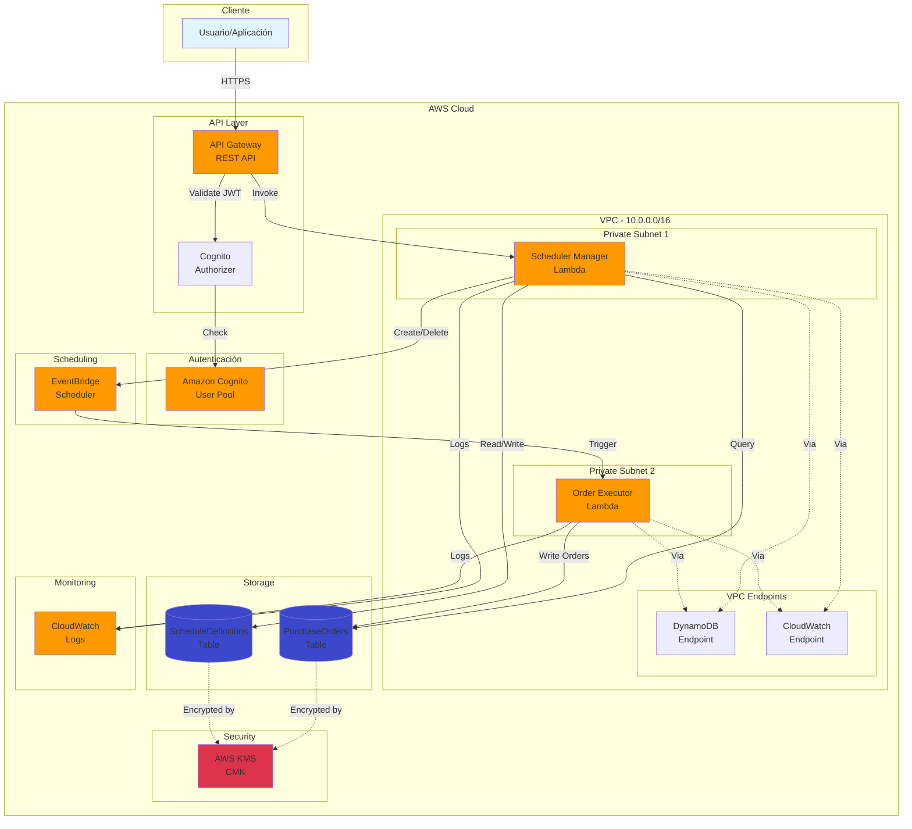

## Flujo de Creación de Schedule

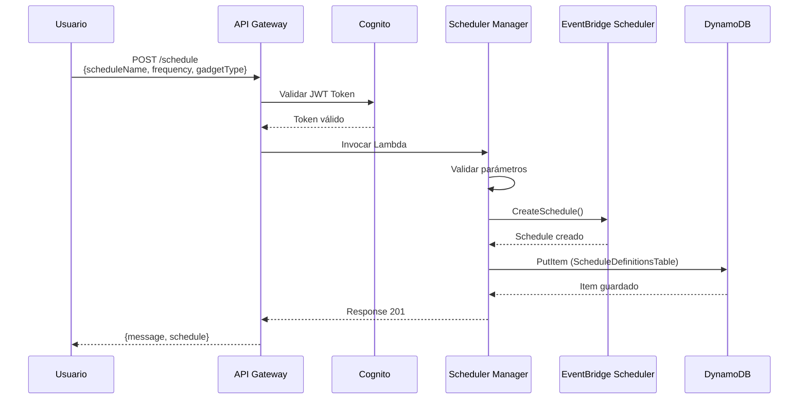

## Flujo de Ejecución Automática de Orden

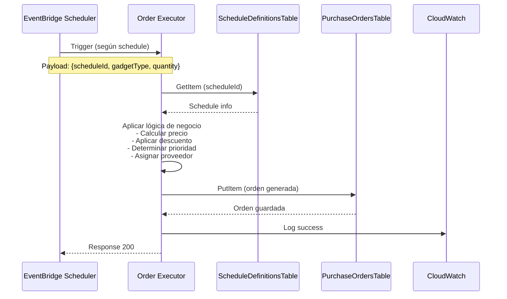

## Flujo de Consulta de Órdenes

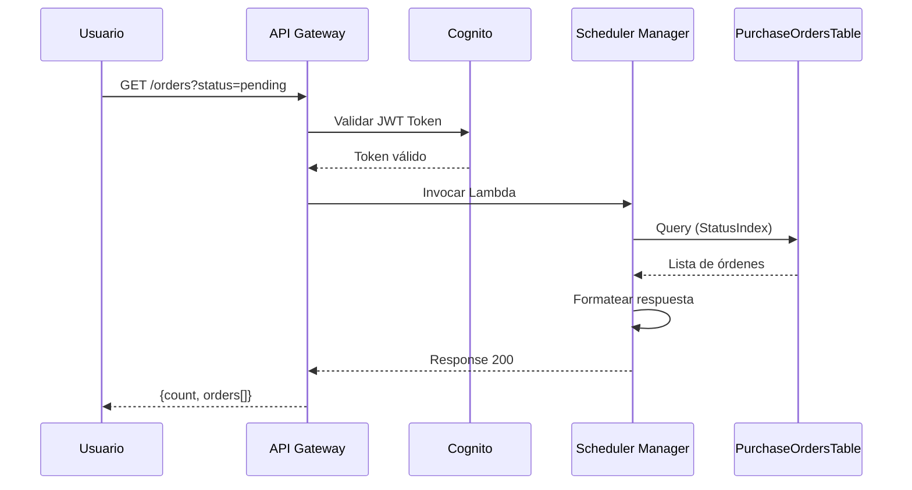

## Arquitectura de Red (VPC)

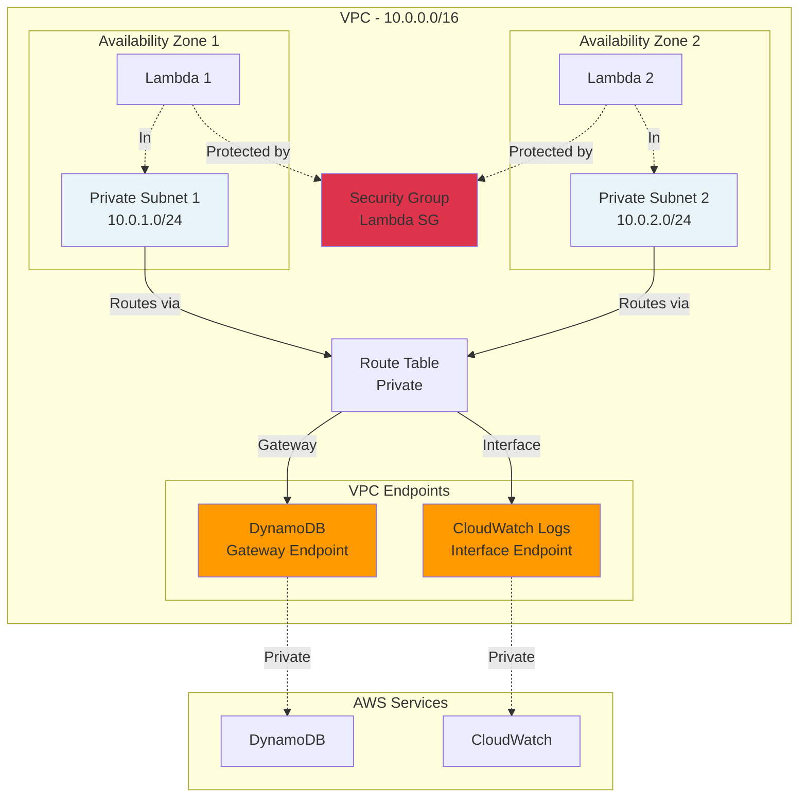

## Modelo de Datos - DynamoDB

```mermaid
erDiagram
    PURCHASE_ORDERS {
        string orderId PK
        string createdAt SK
        string scheduleId
        string gadgetType
        number quantity
        decimal unitPrice
        decimal subtotal
        decimal discountRate
        decimal discountAmount
        decimal total
        string priority
        string supplier
        string status
        number estimatedDeliveryDays
        object metadata
    }
    
    SCHEDULE_DEFINITIONS {
        string scheduleId PK
        string createdAt SK
        string scheduleName
        string frequency
        string gadgetType
        number quantity
        boolean enabled
        string status
        string deletedAt
    }
    
    PURCHASE_ORDERS ||--o{ SCHEDULE_DEFINITIONS : "generated_by"
```

## Flujo de Seguridad

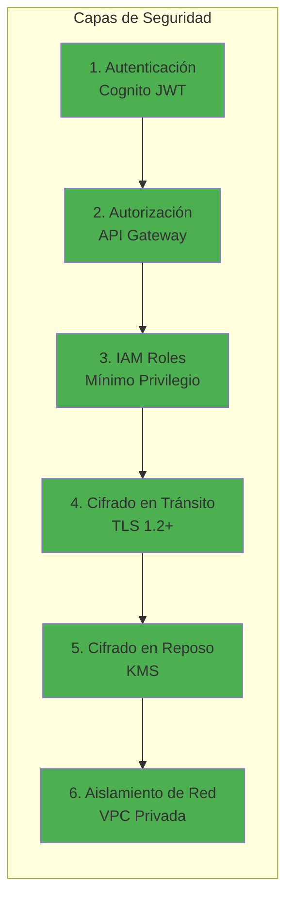

## Ciclo de Vida de un Schedule

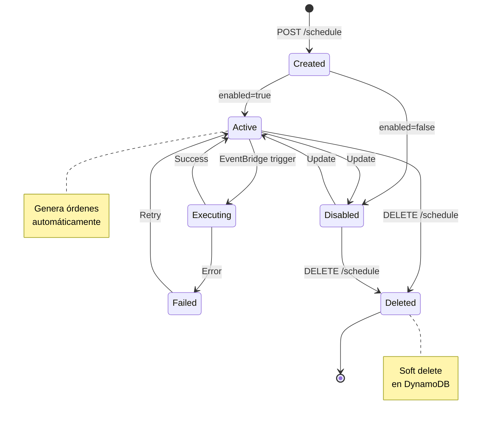

## Estados de una Orden

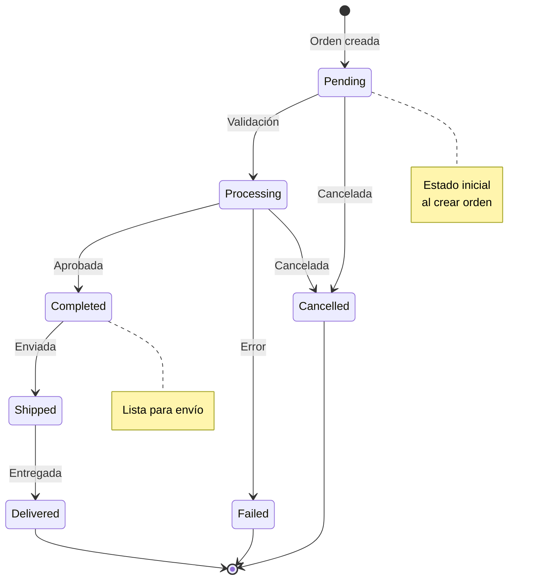

## Arquitectura de Despliegue

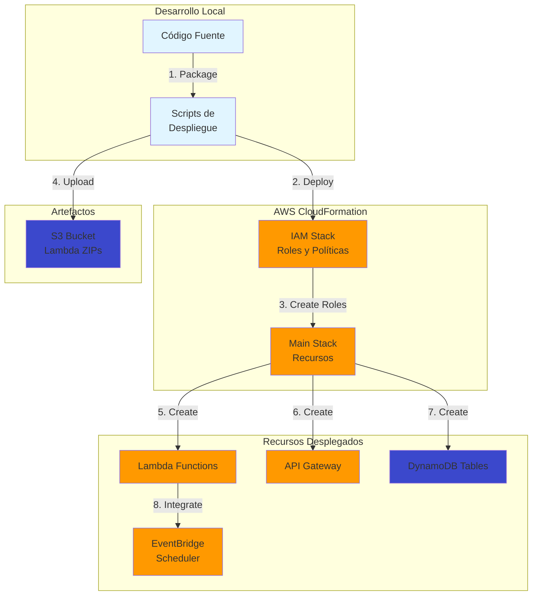

## Monitoreo y Observabilidad

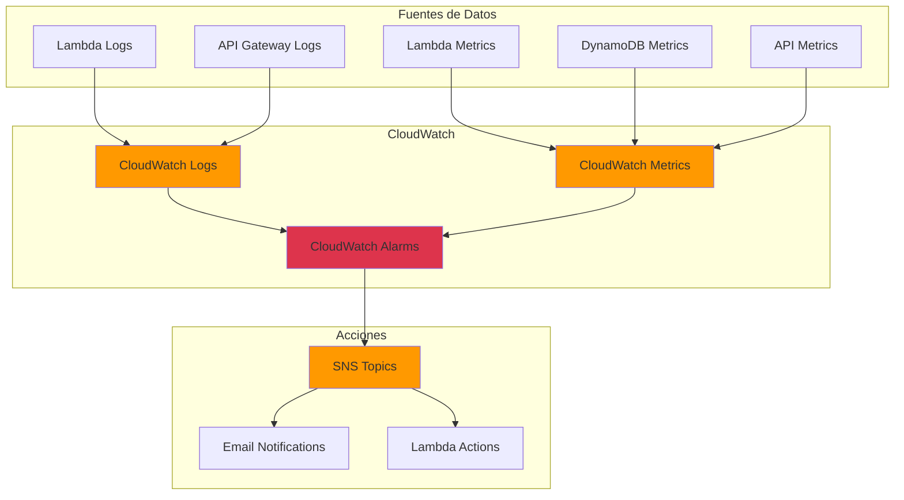

## Escalabilidad

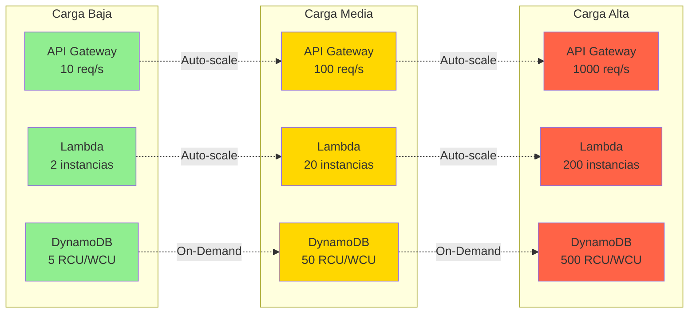

## Costos por Componente

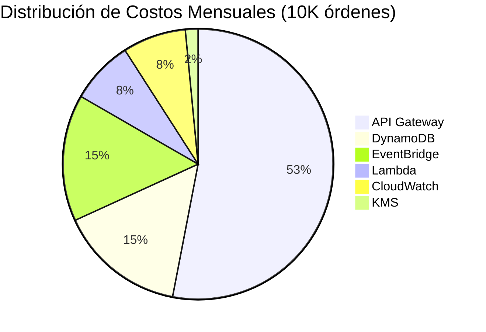

---

## Notas sobre los Diagramas

Estos diagramas están en formato Mermaid y se pueden visualizar en:
- GitHub (renderizado automático)
- VS Code (con extensión Mermaid)
- Herramientas online: https://mermaid.live/

Para exportar a imágenes:
1. Visita https://mermaid.live/
2. Copia el código del diagrama
3. Exporta como PNG/SVG
